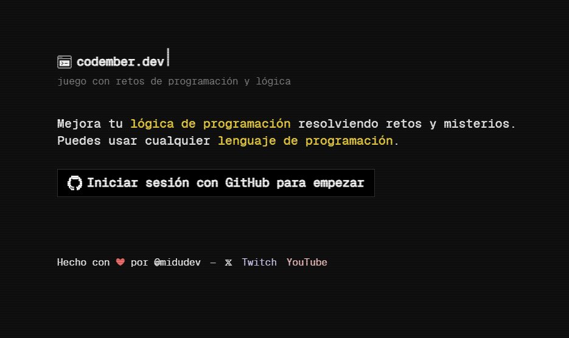

# Codember by midudev

- [¿Qué es Codember?](#qué-es-codember)
- [Objetivo](#objetivo)
- [¿Cómo jugar/participar en Codember?](#cómo-jugarparticipar-en-codember)
- [Retos](#retos)
- [Secretos](#secretos)

## ¿Qué es Codember?
**Codember** es una iniciativa creada por el desarrollador español **Miguel Ángel Durán**, conocido como **midudev**, que consiste en un juego de programación y lógica.

  

## Objetivo
Mejorar las habilidades de programación resolviendo retos y misterios semanales. Este proyecto busca fomentar la práctica constante y el aprendizaje colaborativo entre la comunidad de desarrolladores.

## ¿Cómo jugar/participar en Codember?
Para comenzar, es necesario iniciar sesión con una cuenta de GitHub en el sitio web oficial: [codember.dev](https://codember.dev/ "codember.dev")

Los participantes pueden utilizar cualquier lenguaje de programación para abordar los desafíos propuestos. 

## Retos
1. [Reto 1 - Acceso a terminal](Reto1/ "Reto 1 - Acceso a terminal")
2. [Reto 2 - Detectando acceso no deseado](Reto2/ "Reto 2 - Detectando acceso no deseado")
3. [Reto 3 - ¡Siguiendo la pista de la IA ΩMEGA!](Reto3/ "Reto 3 - ¡Siguiendo la pista de la IA ΩMEGA!")

## Secretos
Para obtener todos los secretos dentro de Codember, puede ver más información en el archivo [Secretos.md](Secretos.md "Secretos.md")